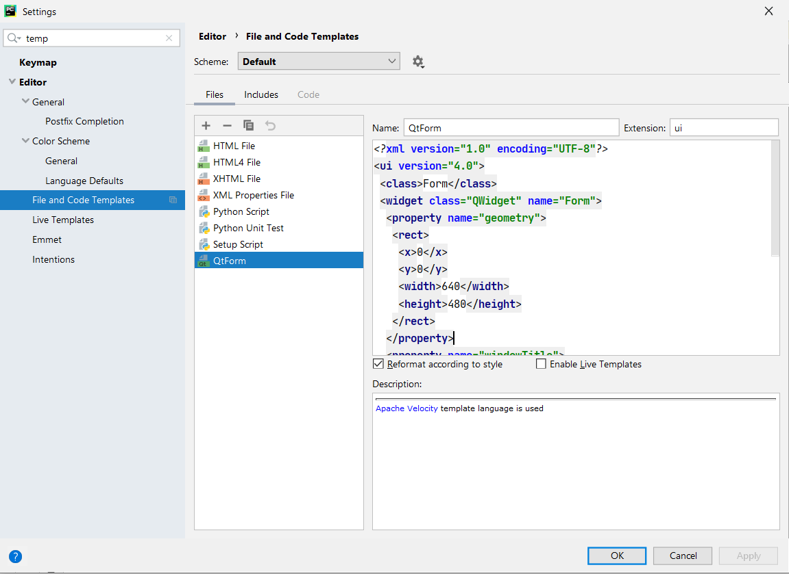
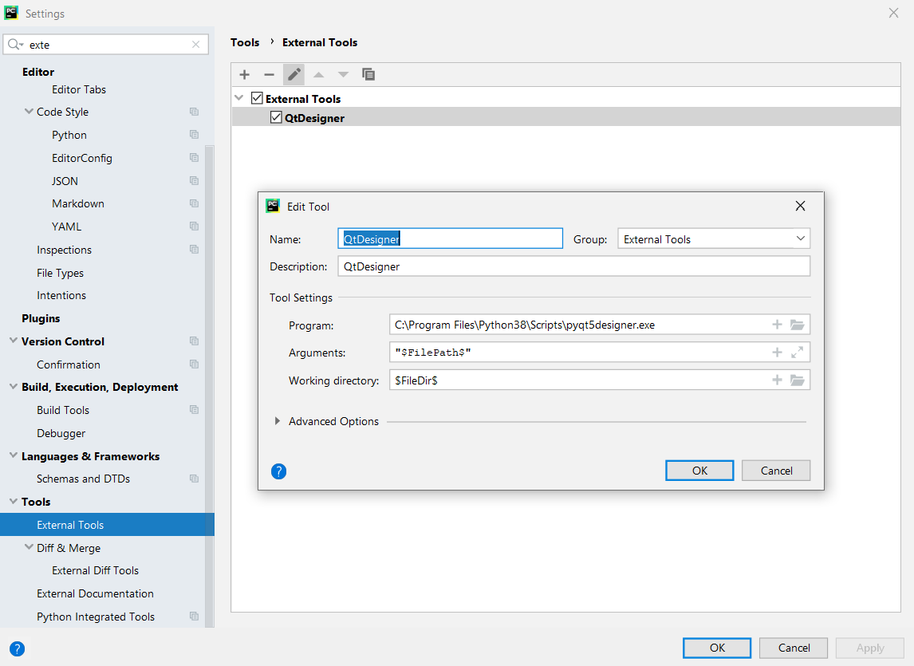

# Python_settings
Настройки PyCharm с PyQt5


```
QtForm ui

<?xml version="1.0" encoding="UTF-8"?>
<ui version="4.0">
 <class>Form</class>
 <widget class="QWidget" name="Form">
  <property name="geometry">
   <rect>
    <x>0</x>
    <y>0</y>
    <width>640</width>
    <height>480</height>
   </rect>
  </property>
  <property name="windowTitle">
   <string>Form</string>
  </property>
 </widget>
 <resources/>
 <connections/>
</ui>

```


```
QtDesigner
C:\Program Files\Python38\Scripts\pyqt5designer.exe
"$FilePath$"
$FileDir$
```
